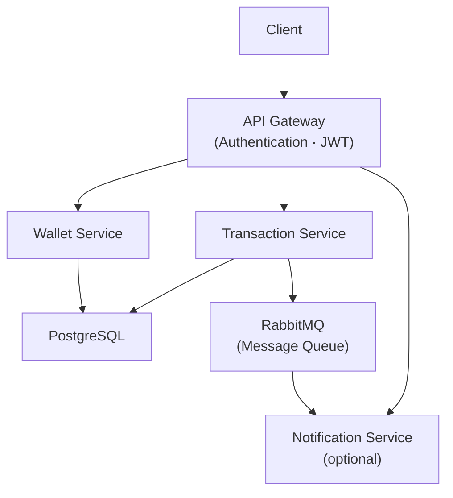
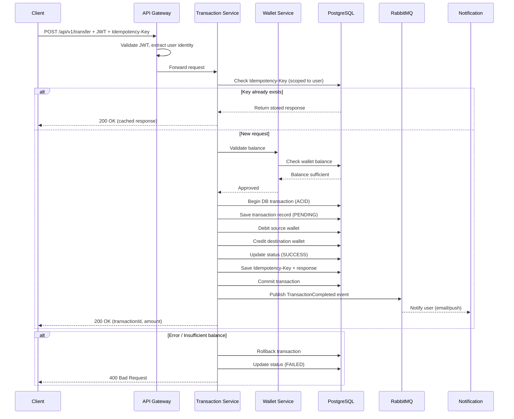
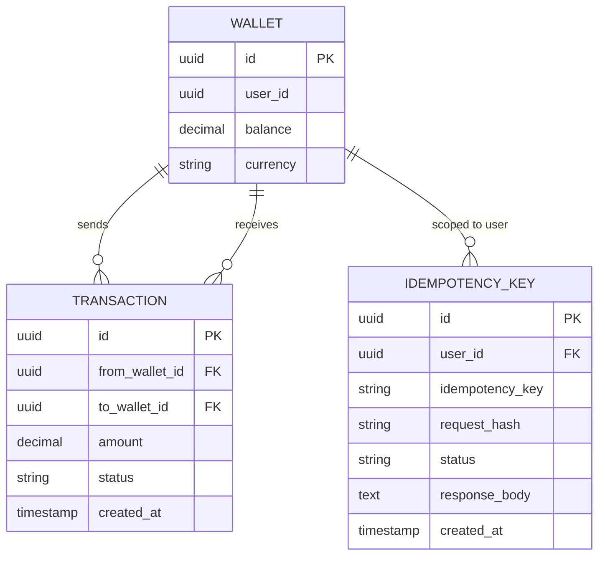
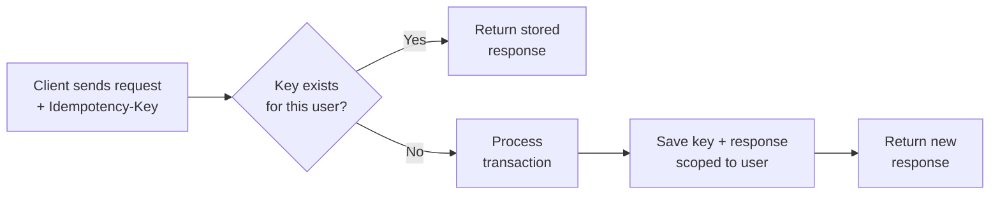
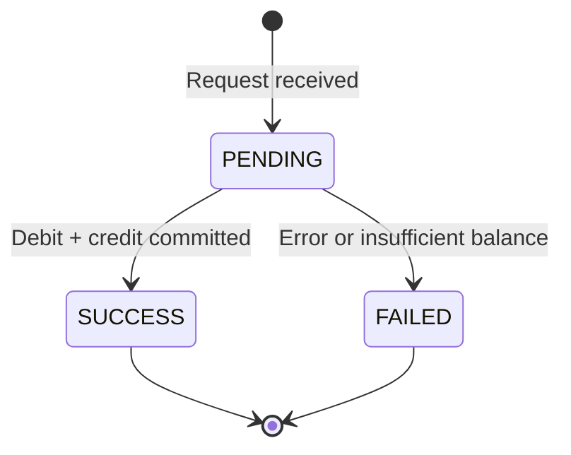

# EFEWallet System

A microservice-based E-Wallet system built with **Spring Boot**, designed for secure and scalable digital payment processing.

---

## Overview

EFEWallet is a backend system that supports:

- Wallet-to-wallet transfer
- Secure authentication using JWT
- Idempotent transaction handling (prevent duplicate requests)
- Microservice architecture
- Event-driven communication using RabbitMQ

---

## Architecture



---

## Request Flow



---

## Database Design



---

## Tech Stack

| Layer | Technology |
|---|---|
| Backend | Spring Boot (Java 17) |
| Database | PostgreSQL |
| ORM | JPA / Hibernate |
| Messaging | RabbitMQ |
| Security | Spring Security + JWT |
| Build Tool | Maven |
| Containerization | Docker |

---

## Core Features

### 1. Transfer Money

- Transfer between wallets
- Validate balance before transaction
- Ensure atomic transaction (ACID)

### 2. Transaction Handling

- Uses database transaction to ensure atomicity
- Debit and credit operations are executed within a single DB transaction
- Rollback is triggered automatically on any failure
- Isolation level: `READ COMMITTED` to prevent dirty reads

### 3. Idempotency



- `Idempotency-Key` is scoped per user — the same key from different users is treated as distinct
- Key is stored alongside a hash of the request to prevent misuse (same key, different payload = rejected)
- Guarantees exactly-once processing for retried requests

### 4. Authentication

- JWT-based authentication via API Gateway
- User identity is extracted from the token server-side
- All APIs are secured — unauthenticated requests are rejected at the gateway

### 5. Transaction Status



### 6. Event-driven Communication

- After a successful transaction, Transaction Service publishes a `TransactionCompleted` event to RabbitMQ
- Notification Service consumes this event to send user notifications (email, push)
- Designed for extensibility: analytics, audit logging, and fraud detection can subscribe independently

---

## API Design

### Transfer

```
POST /api/v1/transfer
```

**Headers:**

```
Authorization: Bearer <token>
Idempotency-Key: <uuid>
```

**Request Body:**

```json
{
  "toWalletId": "wallet_123",
  "amount": 200000,
  "currency": "VND",
  "description": "Transfer money"
}
```

> **Note:** `fromWalletId` is intentionally absent from the request body.
> The source wallet is derived from the authenticated user's JWT token — clients cannot control the source wallet.

**Response:**

```json
{
  "status": "SUCCESS",
  "data": {
    "transactionId": "txn_123",
    "amount": 200000
  }
}
```

---

## Security

- All endpoints require valid JWT authentication
- Source wallet is resolved from the authenticated user — not from client input
- Idempotency keys are scoped per user to prevent cross-user replay attacks

---

## Error Handling

Centralized using `@RestControllerAdvice`. Standard error response format:

```json
{
  "error": "INSUFFICIENT_BALANCE",
  "message": "Not enough balance",
  "status": 400
}
```

---

## Getting Started

**Run with Docker:**

```bash
docker compose up --build
```

**Run locally:**

```bash
mvn clean install
mvn spring-boot:run
```

---

## Future Improvements

- Saga pattern for distributed transactions
- Anti race condition: optimistic locking with `@Version` / pessimistic locking
- Retry mechanism with dead-letter queue (DLQ) for failed events
- Ledger with double-entry accounting
- Monitoring: Prometheus + Grafana
- API Gateway: Spring Cloud Gateway
- Integration testing

---

## Author

GitHub: [QuoocsCuongwf](https://github.com/QuoocsCuongwf)

---

## License

This project is for educational and research purposes.
